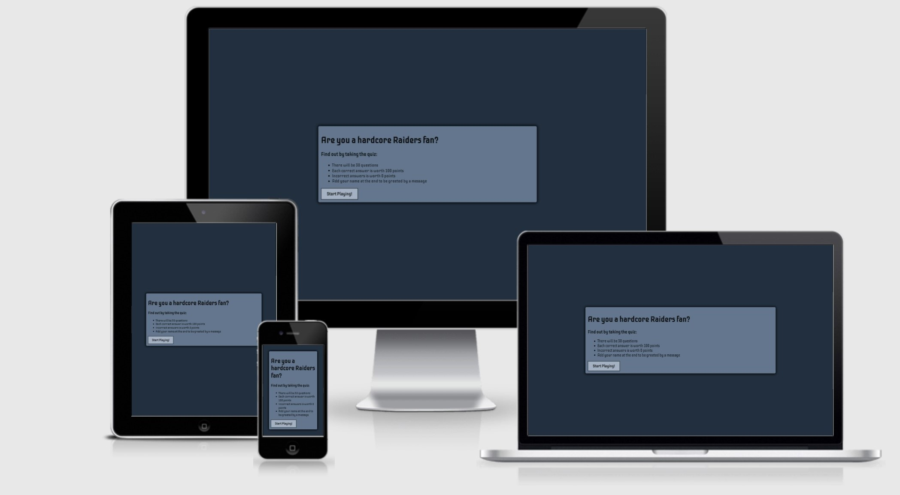
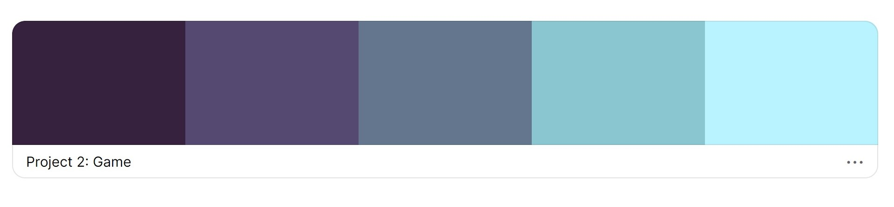
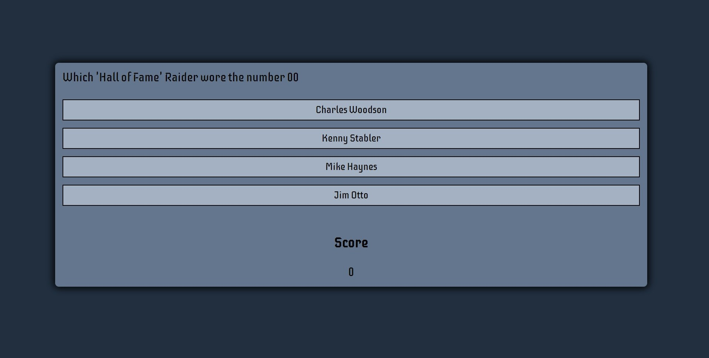
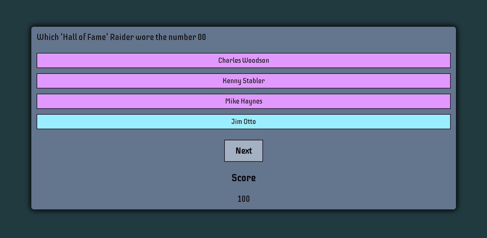

<a href="https://github.com/CHAMPION316/Raiders_Fan_Quiz_Game"><h1 align="center">Are You a hardcore Raiders fan?</h1></a>

Is a quiz game intended for fanatics of the American football team "Las Vegas Raiders". This quiz game will test their knowledge of the teams history by asking them questions related to players, coaches, stats and more.

You can visit the deployed website [here](https://champion316.github.io/Raiders_Fan_Quiz_Game/).

## 1. UX

#### 1.1. Project Goals

To get more people in the world interested in the Raiders franchise with their rich long history. The quiz is designed to test the knowledge of the hardcore fans but anyone can take the quiz and still learn about this teams tradition. Hopefully it will inspire more people to become fans when they learn a few things through taking the quiz.

#### 1.2. User Stories

- As a quiz taker, I want to be challenged about my knowledge of the team.
- As a quiz taker, I want the person who created the questions to know what they are talking about.
- As a quiz taker, I want to learn about the team if I already don't know anything about them.
- As a person, I want to find a football team to root for.
- As a person, I would one day like to go to a game and watch this team play.
- As a fanatic, I want to be challenged with the knowledge I have on the team.
- As a fanatic, I want to learn something new that I may have already not have known.
- As a potential fan, I want to see what makes this team different than the others.

#### 1.3. Wireframes
I used [lucid](https://lucid.app/users/login#/login) to create all my wireframes:

|    Desktop   |    Tablet    |    Mobile    |
|    :----:    |     :----:   |    :----:    |
|[Home Page](wireframes/index_page.jpg)|[Home Page](wireframes/index_page.jpg)|[Home Page](wireframes/index_page_mobile.jpg)|
|[Questions](wireframes/question_container.jpg)|[Questions](wireframes/question_container.jpg)|[Questions](wireframes/correct_wrong_mobile.jpg)|
|[User and Score](wireframes/user_score.jpg)|[User and Score](wireframes/user_score.jpg)|[Username submit](wireframes/username_submit.jpg)|

----

## 2. Features

#### 2.1. Existing features

All of my pages consist of the "box-sizing: border-box" in order to make sizing easier for all devices. A simplistic index.html page [index-page](readme-files/index-intro-page.jpg). 

The color palette I used was auto generated using [coolors](https://coolors.co/)

From left to right in hexadecimal:

* 36213e
* 554971
* 63768d
* 8ac6d0
* b8f3ff

- The Game Area
    - This section is built with a container, containing a question and four options to choose the correct answer to the question. 
    

- The Question Section
    - Whether you choose the correct or wrong answer the options will highlight afterward to reveal the one and only correct answer in it's own unique color while the others all change to their own same color to reveal the wrong answers. 

- The Score Area
    - Upon answering correctly the score at the bottom will increment to 100 points for every correct answer while the the wrong answer will reward you with 0 points. 

---

## 3. Technologies used

- [HTML5](https://en.wikipedia.org/wiki/HTML5) - provides the content and structure for the website.
- [CSS3](https://en.wikipedia.org/wiki/Cascading_Style_Sheets) - styling for my website.
- [JavaScript](https://en.wikipedia.org/wiki/JavaScript) - provide the logic of the language.
- [Lucid](https://lucid.app/users/login#/login) - used to create the project's wireframes.
- [Gitpod](https://gitpod.io/) - used to develop the website
- [Visual Studio Code](https://code.visualstudio.com/download) - used to develop the website outside of Gitpod by running the code safetly offset incase Gitpod's servers crash. 
- [GitHub](https://github.com/) - used to host the project.
- [Google Fonts](https://fonts.google.com/) - used to provide my fonts (font-family: 'Iceberg)
- [Coolors](https://coolors.co/) - used to create the color palette for my whole website.
- [Am I Responsive?](http://ami.responsivedesign.is/) - used to test the site on many devices
- [Responsive Checker](https://www.responsivedesignchecker.com/) - used to test the site on many devices
- [HTML Validator](https://validator.w3.org/) - used to find errors that don't belong in my HTML code.
- [CSS Validator](https://jigsaw.w3.org/css-validator/) - used to find errors that don't belong in my CSS code.
- [JSHint](https://jshint.com/) - used to find errors in my JS code.

## 4. Testing

- The testing process was done on a separate file [TESTING.md](TESTING.md)