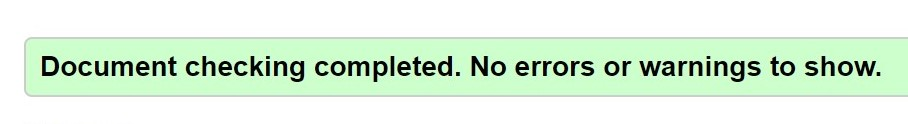
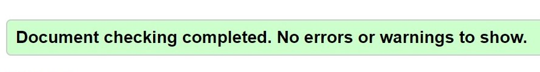
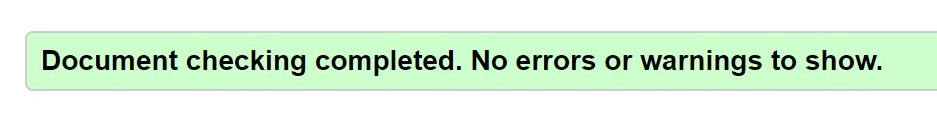
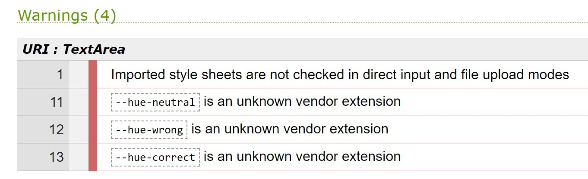
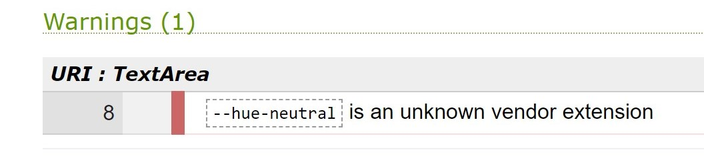
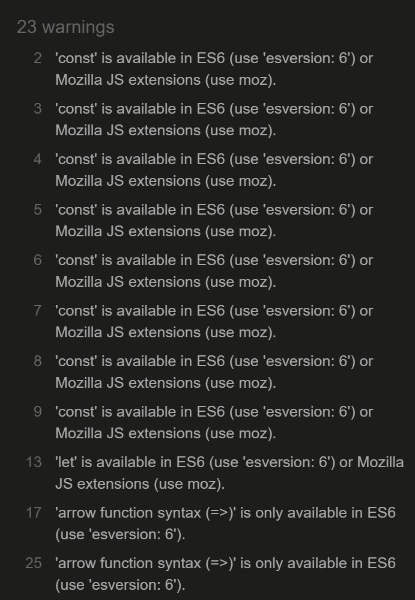

# Testing

## Code validators

[HTML Validator](https://validator.w3.org/) : 

- **Home Page**

- **Game Page**

- **HighScore Page** 

- **Style-CSS Page**

 
    
- Imported style sheets are absolutely fine.
    
- The --hue errors are variables within CSS that are used correctly within the code to help the color styling on certain elements.

- The --hue error is for a color variable that was also used in this stylesheet.

- The warnings are for const variables that are considered to be available in ES6 or Mozilla JS extensions. They work perfectly fine and didn't cause any errors. 